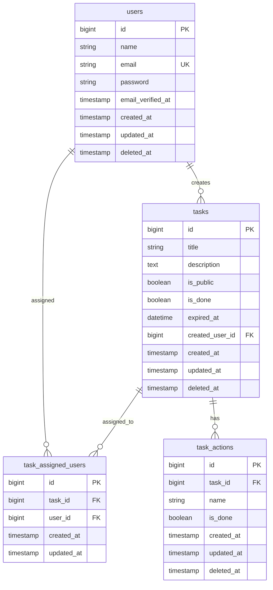

# 実装概要

## プロジェクト概要

Laravel ベースの TODO アプリケーション API。JWT 認証を使用したマルチユーザー対応のタスク管理システム。

## 技術スタック

-   **Framework**: Laravel 11
-   **認証**: JWT Auth (tymon/jwt-auth)
-   **DB**: MySQL/PostgreSQL (SoftDeletes 対応)
-   **API**: RESTful API (v1)

## データモデル

### User

-   ユーザー情報（name, email, password）
-   JWT 認証対応
-   SoftDeletes 対応

### Task

-   タスク情報
    -   `title`: タイトル
    -   `description`: 説明
    -   `is_public`: 公開フラグ
    -   `is_done`: 完了フラグ
    -   `expired_at`: 期限日時
    -   `created_user_id`: 作成者 ID
-   リレーション
    -   `createdUser`: 作成者（belongsTo）
    -   `assignedUsers`: 担当者（belongsToMany）
    -   `actions`: サブアクション（hasMany）
-   SoftDeletes 対応

### TaskAction

-   タスクのサブアクション
    -   `task_id`: タスク ID
    -   `name`: アクション名
    -   `is_done`: 完了フラグ
-   SoftDeletes 対応

## ER 図

## API エンドポイント

### 認証 (`/api/v1`)

-   `POST /login` - ログイン
-   `POST /logout` - ログアウト
-   `POST /register` - ユーザー登録
-   `POST /refresh` - トークンリフレッシュ

### ユーザー (`/api/v1/users`)

-   `GET /me` - 現在のユーザー情報取得
-   `GET /` - ユーザー一覧
-   `PUT /{id}` - ユーザー更新
-   `DELETE /{id}` - ユーザー削除

### タスク (`/api/v1/tasks`)

-   `GET /` - タスク一覧（フィルタ・ソート対応）
-   `GET /{id}` - タスク詳細
-   `POST /` - タスク作成
-   `PUT /{id}` - タスク更新
-   `DELETE /{id}` - タスク削除

### タスクアクション (`/api/v1/tasks/{task}/actions`)

-   `GET /` - アクション一覧
-   `POST /` - アクション作成
-   `PUT /{id}` - アクション更新
-   `DELETE /{id}` - アクション削除

### マイタスク (`/api/v1/users/me/tasks`)

-   `GET /` - 自分のタスク一覧

## 主要機能

### タスクフィルタリング

-   `is_public`: 公開フラグ
-   `is_done`: 完了フラグ
-   `expired_before/after`: 期限日時
-   `created_user_id/ids`: 作成者
-   `assigned_user_id/ids`: 担当者

### 認証・認可

-   JWT 認証による API 保護
-   認証必須エンドポイントは`auth:api`ミドルウェアで保護

### データ整合性

-   トランザクション処理（タスク作成・更新時の担当者設定）
-   外部キー制約による参照整合性
-   SoftDeletes による論理削除
